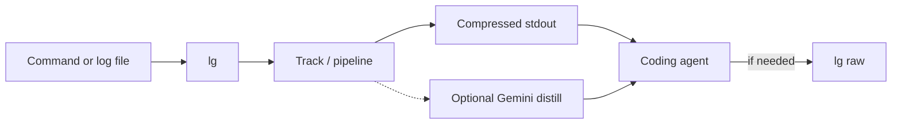

# LogGuard

_Built for developers who regularly paste large pytest, build, CI, or runtime logs into Claude Code, Cursor, or similar coding agents._

**Reduce execution-log context before it reaches AI coding agents.**

Instruct agents via `[.cursorrules](.cursorrules)` (or your editor’s equivalent) so terminal commands go through `lg run`.

LogGuard demo — agent commands compressed for the model

- **~69%** overall character reduction on a Terminal-Bench active-cli dogfood slice
- Showcase peaks: **98%** pytest failure, **94%** CI log, **98%** Kaggle notebook log
- Agents called `lg raw` only **~1–2%** of the time in those windows
- Compression is **local** by default; Gemini is optional

Methodology: `[docs/benchmarks.md](docs/benchmarks.md)`. Pipeline: `[docs/architecture.md](docs/architecture.md)`.

## Results (character reduction)

| Workload                 | Example           | Reduction |
| ------------------------ | ----------------- | --------- |
| pytest failure           | 5,202 → 123 chars | 98%       |
| pytest success           | 4,432 → 20 chars  | ~100%     |
| CI / Docker / pytest log | 10,958 → 685      | 94%       |
| Kaggle notebook log      | 83,211 → 1,702    | 98%       |

These are **size** reductions (chars), not a scored “debugging quality” metric. Full caveats in `[docs/benchmarks.md](docs/benchmarks.md)`.

**Concrete example** — pytest failure track (`pytest_native`):

```text
# raw (excerpt): multi-hundred-line ImportError traceback …
# agent sees:
[T1] ImportError: 'cannot import name \'TaskProgressColumn\' …' @ U:__init__.py:88 -> L:evaluate.py:63
```

## Install

Requires **Python 3.13.x** (Windows / Linux / macOS).

```bash
pip install -e .
# ensure Scripts / bin is on PATH, then:
lg run --dry-run -- python -c "print('hello')"
```

Or without cloning:

```bash
pip install -e "git+https://github.com/dmsavkov/Log-Guard.git@main"
```

**Optional Gemini summarization** (long `full_pipe` logs): set `GOOGLE_API_KEY` in the environment or `.env`. Without a key, use `--dry-run` or `USE_LLM_SUMMARIZATION=false` — deterministic compression still works.

## Agent setup

1. Install `lg` and put it on `PATH`.
2. Copy `[.cursorrules](.cursorrules)` into the project the agent works on.
3. Prefer: `lg run -- <command>` and `lg read <file>` for large static logs.

## How it works



Tracks, flags (`--dry-run`, `--shell`), RTK, storage: `[docs/architecture.md](docs/architecture.md)`.

## Quick start

```bash
# Wrap a command (agent-facing)
lg run -- pytest tests/ -q --tb=short

# Compress an existing log file
lg read path/to/build.log

# Recover the full original for a run id shown in the header
lg raw <id>
```

Default mode is **exec** (safe quoting). Use `--shell` only for pipes / `&&`. Use `--dry-run` to skip LLM distill.

## When to use it

- Agent context fills with pytest, build, CI, or package-manager spam
- Someone `cat`s / reads a huge log into the chat (especially with summarization on)
- You want less context pollution without teaching the agent a new UI

**Not for:** log storage, observability, OpenTelemetry, interactive TUIs (`vim`, `less`), long-running servers (`uvicorn`, `npm run dev`), binary/streaming log platforms, or replacing `grep`.

## vs related tools

|                               | LogGuard                                                    | Headroom     | RTK alone                       |
| ----------------------------- | ----------------------------------------------------------- | ------------ | ------------------------------- |
| Agent exec / pytest / CI logs | Primary focus                                               | General text | Structural filter for some cmds |
| Lossiness                     | Deterministic stages keep debug structure; distill optional | Varies       | Can be aggressive               |
| Needs API key                 | Only for optional Gemini distill                            | —            | No                              |

## Security

- By default, compression is **local** under `~/.logguard/` (override with `LOGGUARD_HOME`).
- Text leaves the machine for Gemini **only** when summarization is enabled and a `GOOGLE_API_KEY` is set.
- Prefer `--dry-run` / disable summarization for sensitive logs.

## Demo

- **GIF** (above) — silent loop of agent + `lg` in practice
- **Short clip** (~same session): `[docs/media/demo-short.mp4](docs/media/demo-short.mp4)`
- **Full walkthrough (~3 min):** publish the source recording as a GitHub Release asset and/or unlisted YouTube, then replace this line with the URL

Text fallback if media does not load: wrap noisy terminal output with `lg run` / `lg read`; agent sees a short summary; recover with `lg raw <id>` when needed.

## Limitations

- Optional Gemini distill adds latency and needs an API key; keep it off for fast local loops.
- Deterministic stages keep debugging structure; semantic summaries can omit detail — use `lg raw`.
- Early project: learning-stage, not pristine; best on Python-centric agent logs.
- Effect of compression on model accuracy is not fully validated.

## License

MIT — see `[LICENSE](LICENSE)`.
