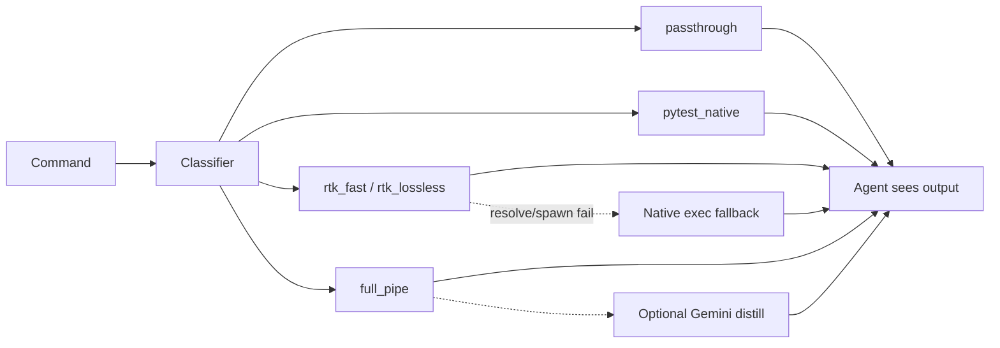

# Architecture

How `lg` decides what to do with a command or file. The product README keeps one Mermaid overview; **this page owns track/CLI detail** — avoid copying pipeline prose back into the README.

## Modes

| Entry | Behavior |
| --- | --- |
| `lg run <cmd…>` | Classify command → track → run once → compress stdout for the agent |
| `lg read <file>` | Always `full_pipe` on file text (no RTK / classifier) |
| `lg raw <id>` | Print original uncompressed capture from `~/.logguard/<id>/` |

## Tracks (`lg run`)

Roughly:

- **passthrough** — small / already-structured tools (`cat`, `git log`, `dir`, `Get-ChildItem`, `New-Item`, …): `simple_green` only. Also **`python -c` / `python3 -c` / `py -c`**, and any stdout that is a single JSON object/array (so agents can `json.loads` the body).
- **pytest_native** — success collapses to a one-line summary; failures keep telegraphic stack signal. Never uses RTK.
- **rtk_*** — if the optional [RTK](https://www.rtk-ai.app/) binary is on `PATH` or under `vendor/rtk/`, structural filter once. If RTK cannot resolve/spawn the target (`ls` missing from `PATH`, etc.), **fall back to native exec** (do not return the RTK error as agent output).
- **full_pipe** — soft clean → stack/warning extract → value extract (long logs) → sanitize → ghost RLE → optional distill.

Length-based routing inside `full_pipe` skips heavy stages on short outputs.

## Windows exec notes

Default mode is argv + `shell=False` (quoting-safe). Before `CreateProcess`:

| Case | Behavior |
| --- | --- |
| PowerShell cmdlet (`Get-ChildItem`, `New-Item`, …) | Wrap as `powershell.exe -NoProfile -NonInteractive -Command …` |
| Unix tool not on `PATH` (`ls`, `grep`, `find`, …) | Resolve from Git Bash `usr\bin` when present |
| One-string `python -c` with triple quotes | If `shlex` fails, keep the whole `-c` payload as one argv token |

Install: `pip install -e .` then ensure Python Scripts is on `PATH` so `lg` works without `uv run`.

## CLI flags worth knowing

| Flag | Meaning |
| --- | --- |
| `--dry-run` | Skip Gemini distill (deterministic stages only). Same idea as `USE_LLM_SUMMARIZATION=false`. |
| `--shell` | Run a shell string (`pipes`, `&&`). Prefer default exec mode for normal commands. |
| `--` | End of `lg` flags (POSIX). |

Do **not** use `lg run` for interactive TUIs (`vim`, `less`) or long-lived servers (`uvicorn`, `npm run dev`).

## Storage

Default: `~/.logguard/<id>/` (`raw.txt`, compressed `lg`, `meta.json`, `intermediate/`). Override with `LOGGUARD_HOME`.

## Agent rules

Ship [`.cursorrules`](../.cursorrules) next to the project so coding agents wrap terminal commands with `lg run`.
